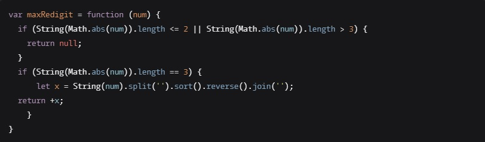

# ___Efimenko Andrey___

## Contacts

___Republic of Belarus___

* __E-mail__:

	* _andrey.efimenko.sp@gmail.com_

* __Phone__:

	* _+375 (33) 691 - 85 - 51_

- - -

## About me
_My goal is to become a successful __IT specialist__. I have the skills work __html__ & __CSS__. Started learning __JavaScript__, got acquainted with the basic concepts of the language (__data types, variables, functions, etc.__).I try to develop a training plan, follow it step by step. Meeting difficulties, I understand them to the end and only then move forward towards the goal._

- - -

## Skills
* ___Html & CSS___
* ___JavaScript___
* ___VScode___
* ___Photoshop 2017___
* ___Figma___

- - -

## Code examples:

- - -

## Work experience
_I have been ___self-taught___ for seven months. My last project is called SPIRIT8, I haven't completed it yet. Link to the project on Github [here](https://github.com/EfimenkoAndrey/SPIRIT8)_.

- - -

## Education
___"Belarusian-Russian university"___
* ___Faculty of:___
_"Mechanical Engineering"_
* ___Department of:___ 
_"Equipment and Technology of Welding Production"._

- - -

## English language
_My English is not very good :( But at the moment I am studying it. I study on the Duolingo app and with a tutor._

- - -